# Сети в Linux :computer:

***

## Contents

1. :up: [Инструмент ipcalc](#part-1-инструмент-ipcalc) 
2. :dancers: [Статическая маршрутизация между двумя машинами](#part-2-статическая-маршрутизация-между-двумя-машинами)
3. :point_up: [Утилита iperf3](#part-3-утилита-iperf3)
4. :closed_lock_with_key: [Сетевой экран](#part-4-сетевой-экран)
5. :arrows_clockwise: [Статическая маршрутизация сети](#part-5-статическая-маршрутизация-сети)
6. :twisted_rightwards_arrows: [Динамическая настройка IP с помощью DHCP](#part-6-динамическая-настройка-ip-с-помощью-dhcp)
7. :children_crossing: [NAT](#part-7-nat)
8. :mask: [Допополнительно. Знакомство с SSH Tunnels](#part-8-дополнительно-знакомство-с-ssh-tunnels)

***

## Part 1. Инструмент ipcalc

###### Подняла виртуальную машину ws1

#### 1.1. Сети и маски

* ##### Определяю и записываю в отчет адрес сети 192.167.38.54/13

* Скачиваем __ipcalc__ командой 

``sudo apt install ipcalc``

* Ввожу команду 

``ipcalc -b 192.167.38.54/13`` 

> -b —nobinary Подавить поразрядный вывод

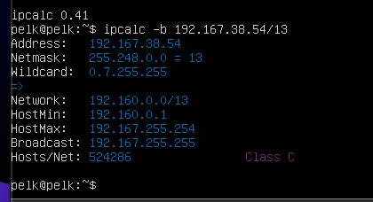

***

* ##### Определяю и записываю в отчет перевод маски 255.255.255.0 в префиксную и двоичную запись

> Перфиксная запись маски (CIDR-запись) - число единиц в двоичном представлении маски. 

* Ввожу команду 

``ipcalc 0.0.0.0 255.255.255.0``

Обычная - 255.255.255.0
__Двоичная - 11111111.11111111.11111111.00000000__
__Префиксная -  /24__

* ##### Определяю и записываю в отчет перевод маски  ``/15`` в обычную и двоичную

* Ввожу команду 

``ipcalc 0.0.0.0 /15``

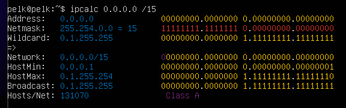

__Обычная - 255.254.0.0__
__Двоичная - 11111111.11111110.00000000.00000000__
Префиксная - /15 

* ##### Определяю и записываю в отчет перевод маски ``11111111.11111111.11111111.11110000`` в обычную и префиксную

* Ввожу команду 

``ipcalc 0.0.0.0 11111111.11111111.11111111.11110000`` 

> Улитилита __ipcalc__ не работает с двоичным видом масок, поэтому переводим в префиксную 

* Ввожу команду 

``ipcalc 0.0.0.0 /28`` 

* Сравниваем двоичную запись, чтобы убедиться в правильности перевода

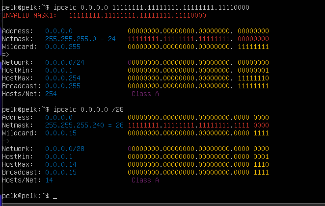

__Обычная - 255.255.255.240__
Двоичная - 11111111.11111111.11111111.11110000
__Префиксная - /28__

***

* ##### Определяю и записываю в отчет минимальный и максимальный хост в сети 12.167.38.4 при маске /8 

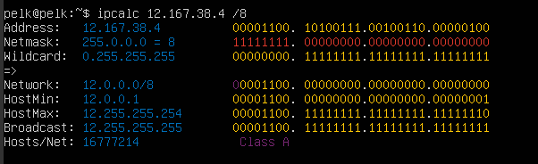

__HostMin: 12.0.0.1__
__HostMax: 12.255.255.254__

* ##### Определяю и записываю в отчет минимальный и максимальный хост в сети 12.167.38.4 при маске 11111111.11111111.00000000.00000000 

> Переводим двоичную маску в прифексную и получаем __/16__

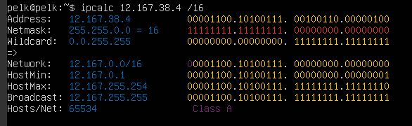

__HostMin: 12.167.0.1__
__HostMax: 12.167.255.254__

* ##### Определяю и записываю в отчет минимальный и максимальный хост в сети 12.167.38.4 при маске 255.255.254.0

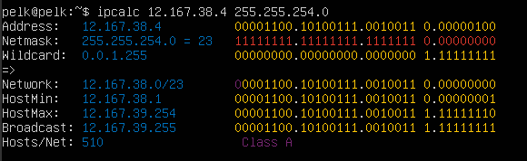

__HostMin: 12.167.38.1__
__HostMax: 12.167.39.254__

* ##### Определяю и записываю в отчет минимальный и максимальный хост в сети 12.167.38.4 при маске /4

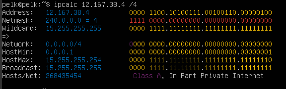

__HostMin: 0.0.0.1__
__HostMax: 15.255.255.254__

***

#### 1.2. localhost

* ##### Определяю и записываю в отчет  можно ли обратиться к приложению, работающему на localhost, со следующими IP: 194.34.23.100, 127.0.0.2, 127.1.0.1, 128.0.0.1

> __localhost__ (так называемый, «местный» от англ. local, или «локальный хост», по смыслу — этот компьютер) — в компьютерных сетях, стандартное, официально зарезервированное доменное имя для частных IP-адресов в диапазоне 127.0.0.1 — 127.255.255.254, RFC 2606.

 > IP: 194.34.23.100 __NO__

 * Проверяем командой ``ipcalc 194.34.23.100``

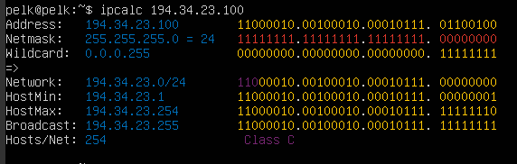

 > IP: 127.0.0.2 __YES__

 * Проверяем командой ``ipcalc 127.0.0.2``

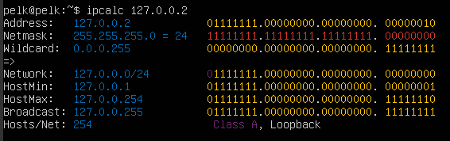

 > IP: 127.1.0.1 __YES__

 * Проверяем командой ``ipcalc 127.1.0.1``

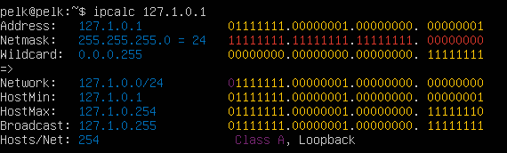

 > IP: 128.0.0.1 __NO__

* Проверяем командой ``ipcalc 128.0.0.1``

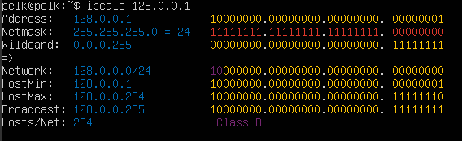

***

#### 1.3. Диапазоны и сегменты сетей

* ##### Определить и записать в отчёт:  какие из перечисленных IP можно использовать в качестве публичного, а какие только в качестве частных: 10.0.0.45, 134.43.0.2, 192.168.4.2, 172.20.250.4, 172.0.2.1, 192.172.0.1, 172.68.0.2, 172.16.255.255, 10.10.10.10, 192.169.168.1

> Публичный IP-адрес — это IP-адрес, уникальность которого определяется не в локальной сети, а глобально, во всей сети интернет. Если вашему компьютеру присвоен публичный IP-адрес, то его возможности во взаимодействии с другими компьютерами (устройствами) сети интернет не ограничены.

> Частный IP-адрес (англ. private IP address), также называемый внутренним, внутрисетевым или локальным — IP-адрес, принадлежащий к специальному диапазону, не используемому в сети Интернет. Такие адреса предназначены для применения в локальных сетях, распределение таких адресов никем не контролируется.

> К частным "серым" адресам относятся IP-адреса из следующих подсетей: 
> * От 10.0.0.0 до 10.255.255.255 с маской 255.0.0.0 или /8
> * От 172.16.0.0 до 172.31.255.255 с маской 255.240.0.0 или /12
> * От 192.168.0.0 до 192.168.255.255 с маской 255.255.0.0 или /16
> * От 100.64.0.0 до 100.127.255.255 с маской подсети 255.192.0.0 или /10; 

 > IP: 10.0.0.45 __PRIVATE__

 * Проверяем командой ``ipcalc 10.0.0.45``

 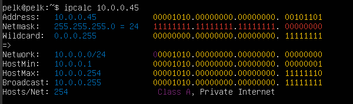

 > IP: 134.43.0.2 __PUBLIC__

 * Проверяем командой ``ipcalc 134.43.0.2``

 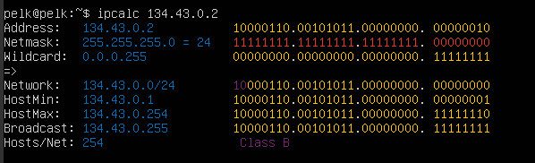

 > IP: 192.168.4.2 __PRIVATE__

 * Проверяем командой ``ipcalc 192.168.4.2``

 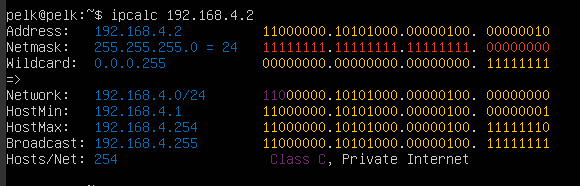

 > IP: 172.20.250.4 __PRIVATE__

 * Проверяем командой ``ipcalc 172.20.250.4``

 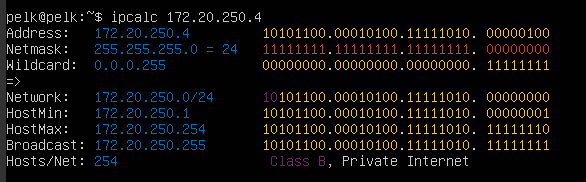
 
 > IP: 172.0.2.1 __PUBLIC__

 * Проверяем командой ``ipcalc 172.0.2.1``

 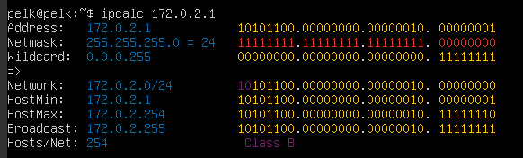

 > IP: 192.172.0.1 __PUBLIC__

 * Проверяем командой ``ipcalc 192.172.0.1``

 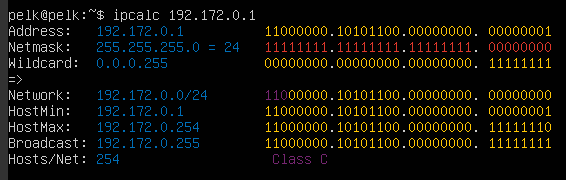

 > IP: 172.68.0.2 __PUBLIC__

 * Проверяем командой ``ipcalc 172.68.0.2``

 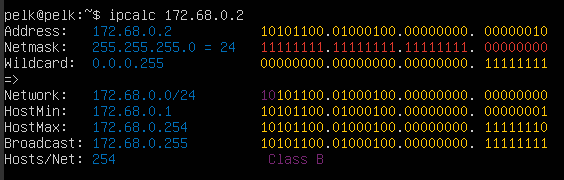

 > IP: 172.16.255.255 __PRIVATE__

 * Проверяем командой ``ipcalc 172.16.255.255``

 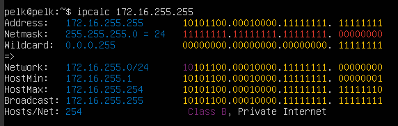

 > IP: 10.10.10.10 __PRIVATE__

 * Проверяем командой ``ipcalc 10.10.10.10``

 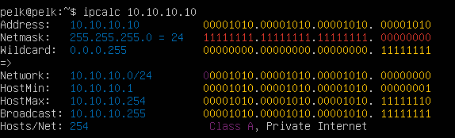

 > IP: 192.169.168.1 __PUBLIC__

 * Проверяем командой ``ipcalc 192.169.168.1``

 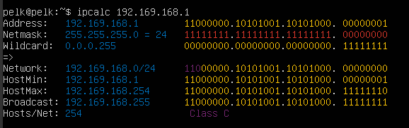

 ***

* ##### Определить и записать в отчёт:  какие из перечисленных IP адресов шлюза возможны у сети 10.10.0.0/18: 10.0.0.1, 10.10.0.2, 10.10.10.10, 10.10.100.1, 10.10.1.255

 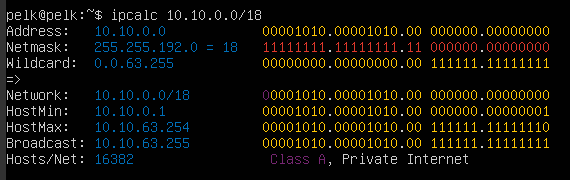

  __Сеть 10.10.0.0/18:__ 
  Шлюз: 10.0.0.1  __NO__
  Шлюз: 10.10.0.2 __YES__
  Шлюз: 10.10.10.10 __YES__
  Шлюз: 10.10.100.1  __NO__
  Шлюз: 10.10.1.255 __YES__

*** 

## Part 2. Статическая маршрутизация между двумя машинами

###### Подняла две виртуальные машины (далее -- ws1 и ws2) 

 

* ##### С помощью команды ``ip a`` смотрю существующие сетевые интерфейсы

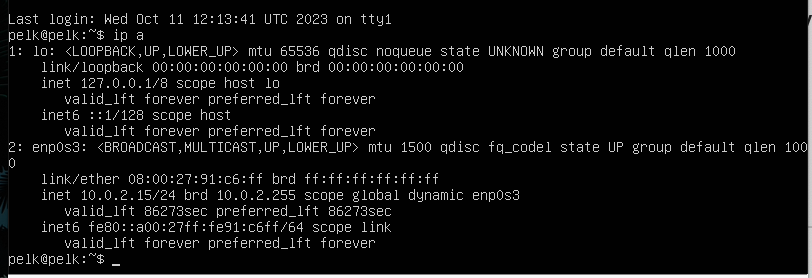

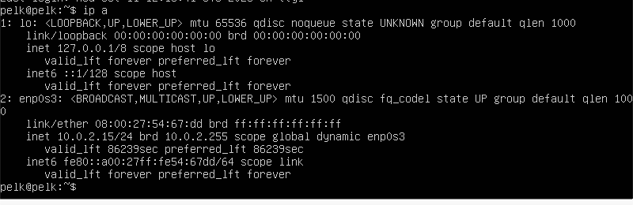

* ##### Описываю свой сетевой интерфейс, соответствующий внутренней сети, на обеих машинах.  Задаю следующие адреса и маски: ws1 - 192.168.100.10, маска /16, ws2 - 172.24.116.8, маска /12

* Открываю netplan командой 

``sudo nano /etc/netplan/00-installer-config.yaml``

 на обеих машинах 

* Вношу изменения 

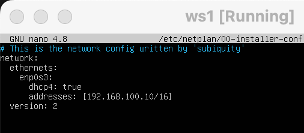

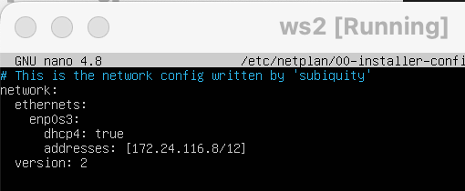

* ##### Выполняю команду ``netplan apply`` для перезапуска сервиса сети

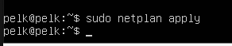

* Проверяем, что изменения внеслись командой ``ip a`` 

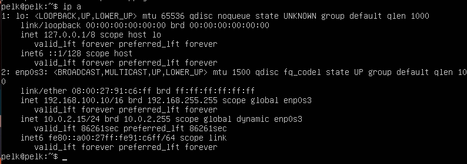

#### 2.1. Добавление статического маршрута вручную

> * Создаю дополнительный адаптер в __VirtualBox__ , через настройки виртуальной машины > сеть > добавляем второй адаптер 

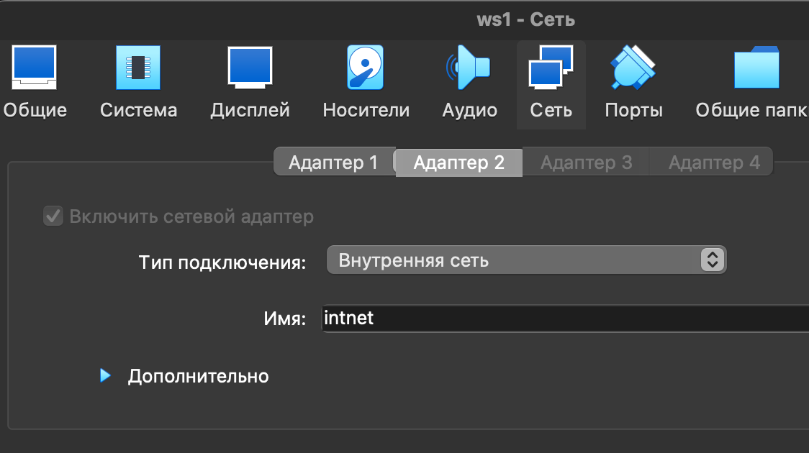

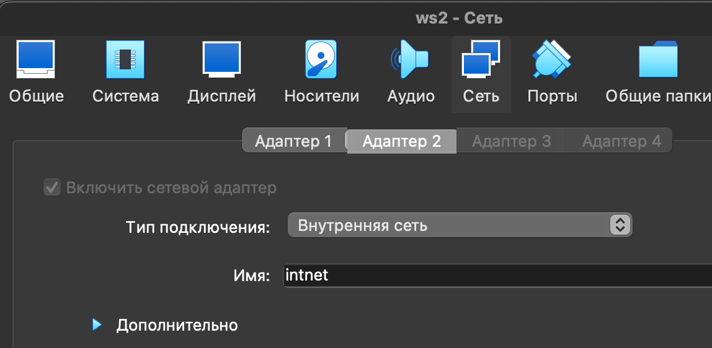

* ##### Добавляю статический маршрут от одной машины до другой и обратно при помощи команды вида ``ip r add``

* Команда для первой машины 

``sudo ip r add 172.24.116.8 via 192.168.100.10 dev enp0s3``

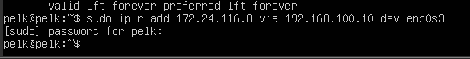

* Команда для второй машины

 ``sudo ip r add 192.168.100.10  via 172.24.116.8 dev enp0s3``

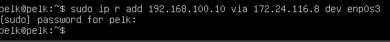

* ##### Пингую соединение между машинами

* Для первой машины командой

 ``ping -c 5 192.168.100.10``

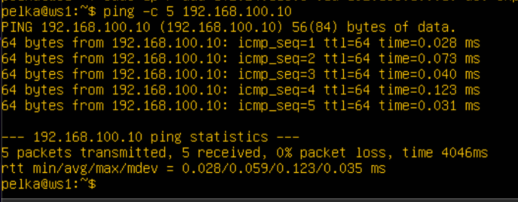

* Для второй машины командой 

``ping -c 5 172.24.116.8``

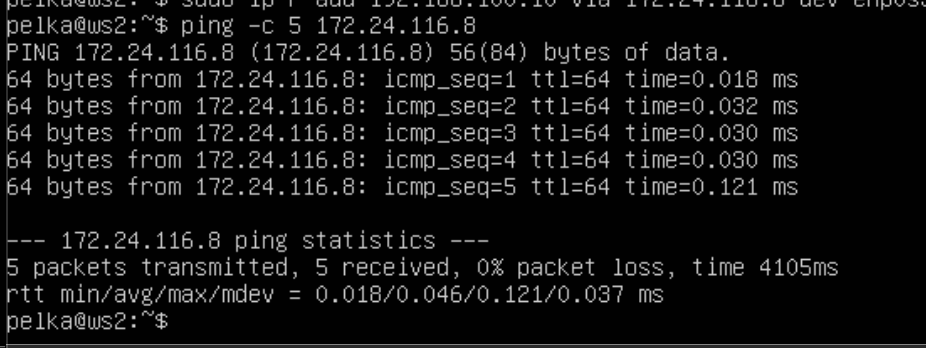

***

#### 2.2. Добавление статического маршрута с сохранением

* ##### Перезапускаю машины 

* Ввожу команду ``sudo reboot``

* Проверяем, что после перезапуска маршруты не сохранились командой ``ip r``

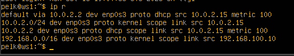

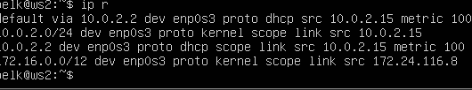

* ##### Добавляю статический маршрут от одной машины до другой с помощью файла etc/netplan/00-installer-config.yaml

* Ввожу команду ``sudo nano /etc/netplan/00-installer-config.yaml`` на двух машинах и меняю содержимое 

* Выполняю команду ``netplan apply`` для перезапуска сервиса сети

* Проверяем маршруты  командой ``ip r``

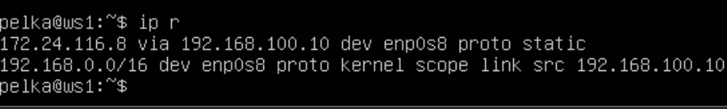

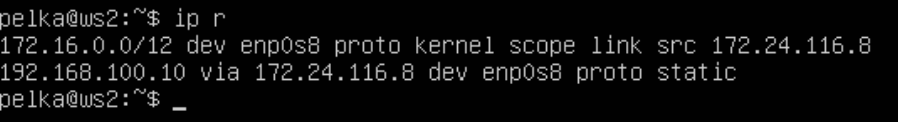

* ##### Пингую соединение между машинами

* Для первой машины командой ``ping -c 5 192.168.100.10``

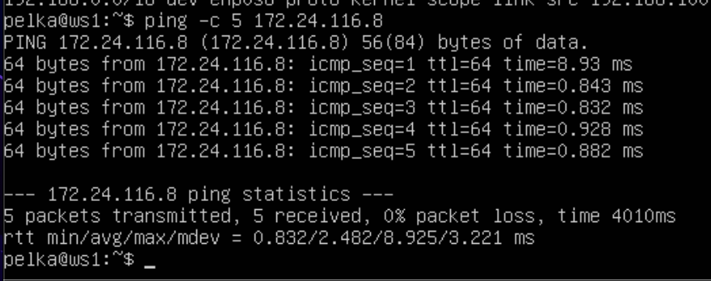

* Для второй машины командой ``ping -c 5 172.24.116.8``

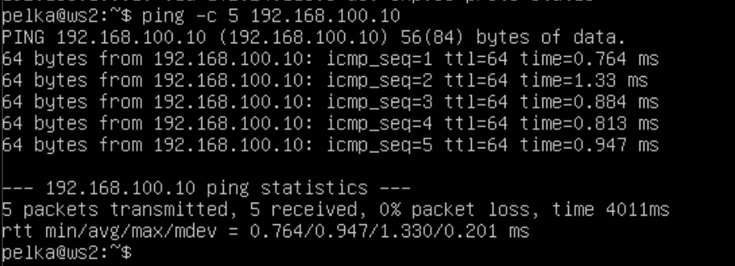

***

## Part 3. Утилита iperf3

 ###### Будем проверять скорость соединения с помощью утилиты iperf3 

#### 3.1. Скорость соединения

* ##### Перевожу и записываю в отчёт:

 __8 Mbps__ (мегабит в секуду) = __1 MB/s__ (мегабайт в секунду)

 __100 MB/s__ (мегабайт в секунду) = __800 000 Kbps__ (килобит в секунду)

 __1 Gbps__ (гигабит в секунду) = __1 000 Mbps__ (мегабит в секунду)

#### 3.2. Утилита iperf3

> __Iperf3__ — кроссплатформенная консольная клиент-серверная программа — генератор TCP, UDP и SCTP трафика для тестирования пропускной способности сети.

* Скачиваю ультилиту командой ``sudo apt install iperf3``

> __Флаги__ 
__-p, --port__ - указать порт для сервера или к какому порту надо подключаться;
__-f, --format__ - формат выводимых данных, доступны значения: k,m,g,t,K,M,G,T;
__-i, --interval__ - интервал времени между выводами результата тестирования;
__-F, --file__ - использовать данные из файла вместо генерации случайных данных;
__-V, --verbose__ - вывод максимально подробной информации;
__-J, --json__ - вывод в формате JSON;
__--logfile__ - записывать информацию в лог файл;
__--forceflush__ - очищать историю вывода перед выводом следующего результата тестирования;
__-v, --version__ - версия программы.

> __Синтаксис__
На сервере ``iperf3 -s опции``
На клиенте ``iperf3 -c адрес_сервера опции``

* ##### Измеряю скорость соединения между ws1 и ws2

* На машине ws1 ввожу ``iperf3 -s``

* На машине ws2 ввожу ``iperf3 -с 192.168.100.10``

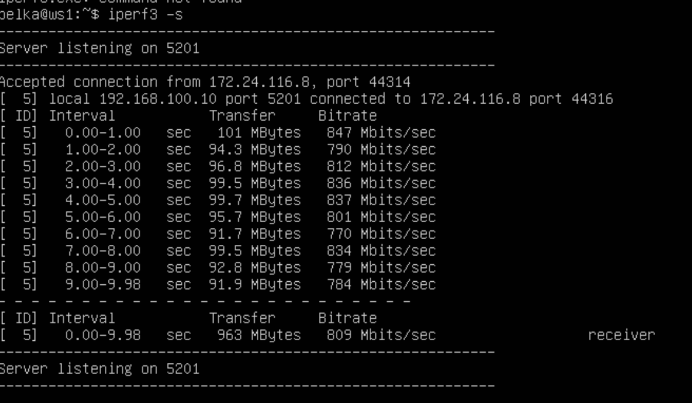

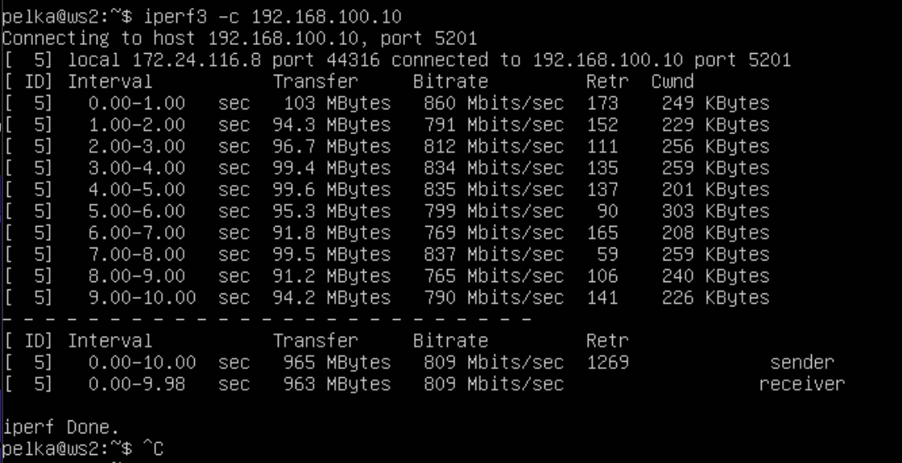

***

## Part 4. Сетевой экран

#### 4.1. Утилита iptables

> __iptables__ — утилита командной строки, является стандартным интерфейсом управления работой межсетевого экрана (брандмауэра) netfilter для ядер Linux версий 2.4, 2.6, 3.x, 4.x. Для использования утилиты iptables требуются привилегии суперпользователя (root).

* __Создаю и наполняю фаил командой ``sudo nano /etc/firewall.sh`` на ws1 и ws2:__

 ###### Нужно добавить в файл подряд следующие правило: на ws1 применить стратегию когда в начале пишется запрещающее правило, а в конце пишется разрешающее правило и на ws2 применить стратегию когда в начале пишется разрешающее правило, а в конце пишется запрещающее правило (это касается правил 3 и 4)

* #### Нужно добавить в файл подряд следующиe правилa:
* ##### Oткрыть на машинах доступ для порта 22 (ssh) и порта 80 (http)

* ##### Запретить ``echo reply`` (машина не должна "пинговаться”, т.е. должна быть блокировка на OUTPUT)

* ##### Разрешить ``echo reply`` (машина должна "пинговаться")

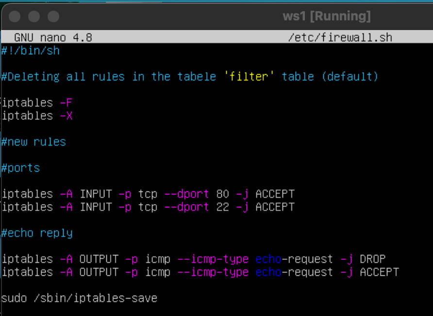

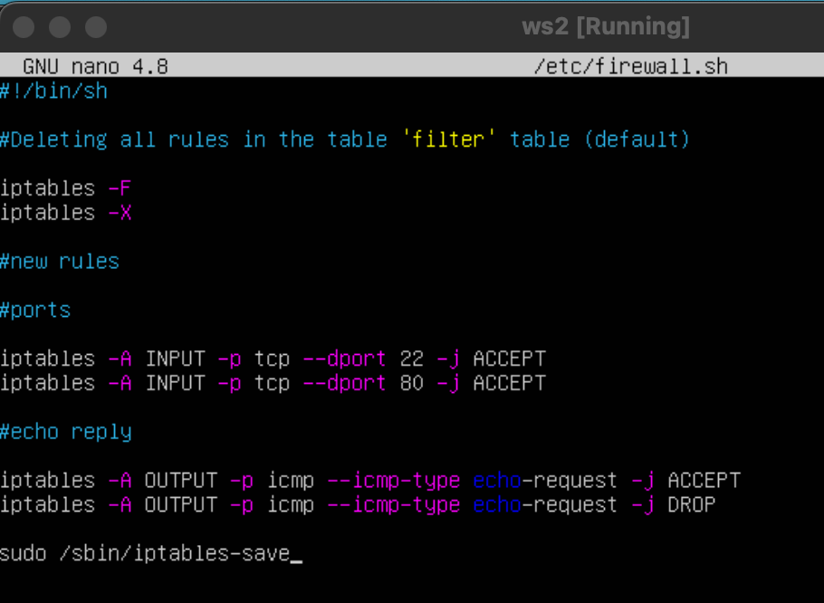

 > __-A__ Добавить одно или несколько правил в конец указанной цепочки. Если имя источника и/или стока (назначения) соответствует нескольким адресам, правило будет добавлено для всех возможных комбинаций адресов.
 __-p__ Сетевой протокол применяемого правила или проверяемого пакета. Допустимые значения: tcp, udp, icmp, all. Также можно указывать в виде числа (соответствующего одному из перечисленных ил иному протоколу). Названия протоколов также можно брать из файла /etc/protocols. Знак "!" перед названием протокола инвертирует результат теста. Число 0 эквивалентно all. Значение all соответствует всем протоколами и используется если данный параметр опущен.
 __--dport__ Пропускать пакеты с портом назначения равным одному из указанных.
 __-j__ Определяет цель правила; т.е., что делать, когда пакет попадает под условия правила.  Если эта опция не задана в правиле, то правило не будет применяться, но счётчик количества применений правила будет увеличен.
 __--icmp-type__ Тип ICMP в виде числа или имени в соответствии с
 iptables -p icmp -h .
 __ACCEPT__ Разрешить.
 __DROP__ Запретить.

*  __Запускаю файлы на обеих машинах командами ``chmod +x /etc/firewall.sh`` и ``bash /etc/firewall.sh``__

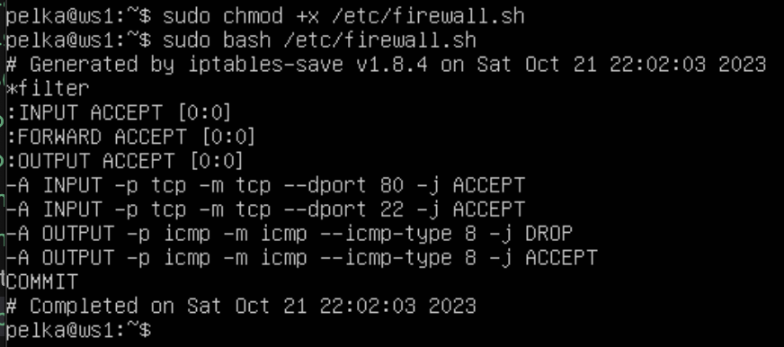

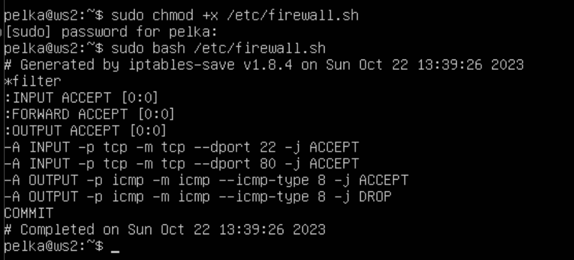

* Проверяю что все работает пингуя машины между друг другом, со сторонним сервисом и командой ``iptables -L``

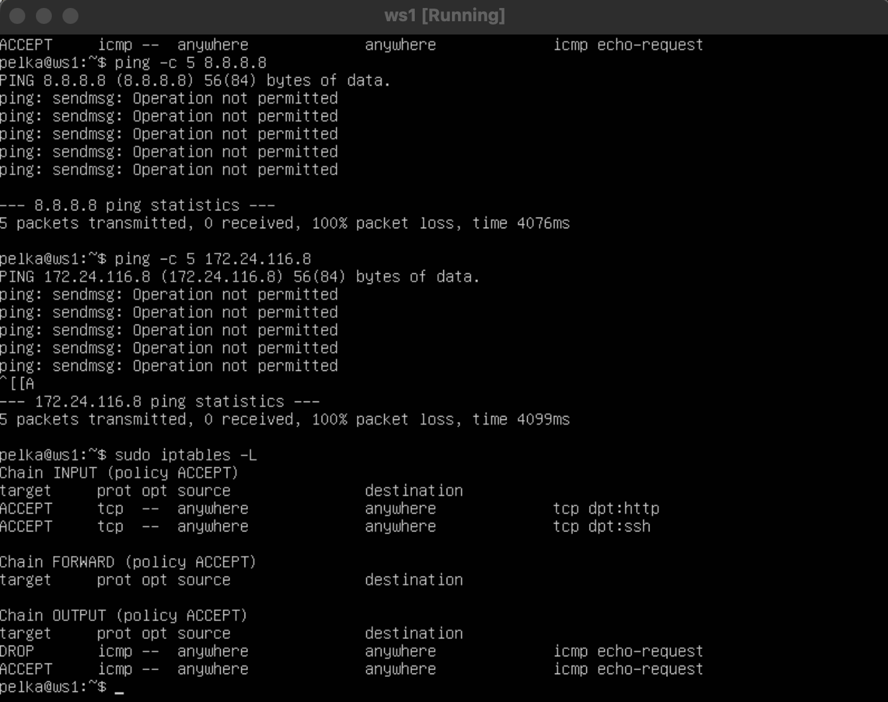

* Смотрим как работают наши правила командой ``iptables -L -v`` 

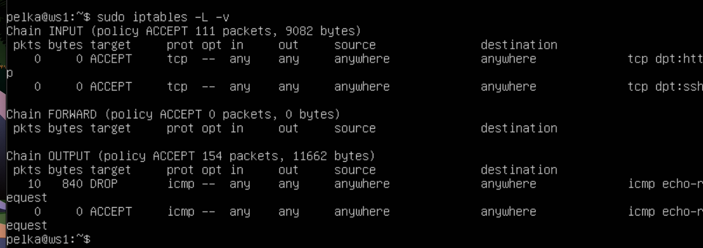

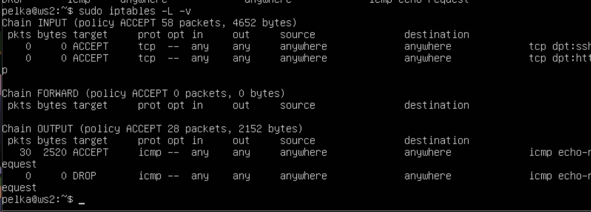

*  __Описываю разницу между стратегиями, применёнными в первом и втором файлах:__ 

> В файлах ``/etc/firewall.sh`` был использован флаг ``-j`` - выбрать действие, если правило подошло.
Таким образом, при обработке правил сверху-вниз при совпадении описанных условий применяется то правило, что расположено выше.
Из-за того, что в файле ws1 запрещающее правило находится выше разрешающего, виртуальная машина 1 не может пропинговать виртуальную машину 2.
Для виртуальной машины 2 ситуация противоположная, поскольку разрешающее правило выше запрещающего.

#### 4.2. Утилита nmap

* ##### Командой ping нахожу машину, которая не "пингуется".

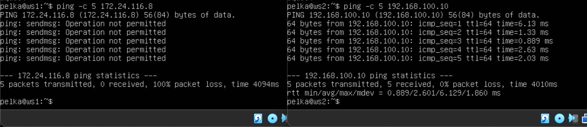

> Не пингуется ws1

* ##### После чего утилитой nmap показываю, что хост машины запущен

* Устанавливаю ``nmap`` командой ``sudo apt install nmap`` 

* Ввожу команду ``sudo nmap IP-address`` и ищу строчку  ``Host is up``

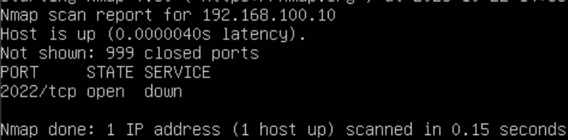

> DONE

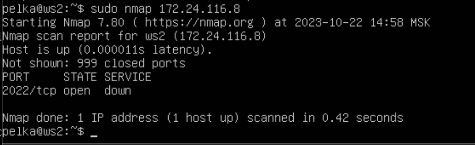

> DONE

* ##### Сохранить дампы образов виртуальных машин

* Для этого в настройках машины выбираем __``ОПЦИИ``__ и далее __``СНИМОК``__

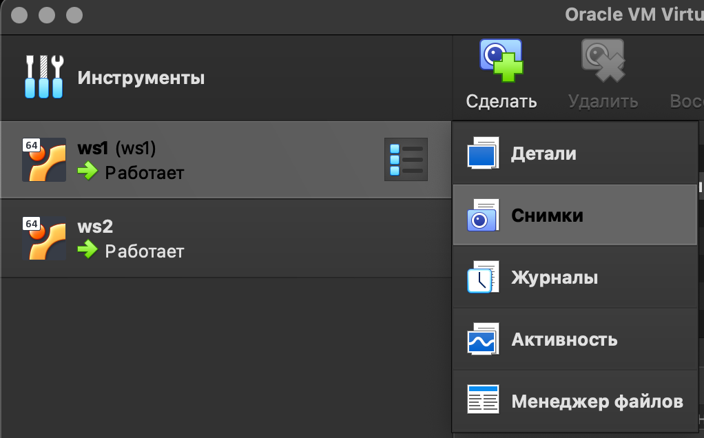

* Задаем название и описываем 

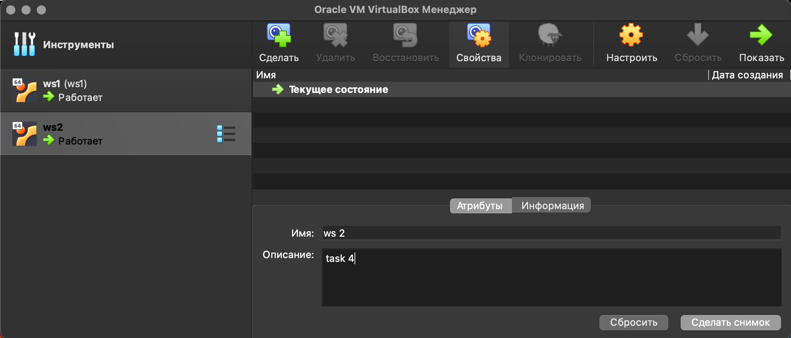

* Нажимаем кномку сделать снимок 

***

## Part 5. Статическая маршрутизация сети

###### Поднять пять виртуальных машин (3 рабочие станции (ws11, ws21, ws22) и 2 роутера (r1, r2))

* Создаю виртуальную машину ws11 и далее клонирую ее 4 раза 

* Меняю hostname командой ``sudo nano /etc/hostname`` на всех машинах 

* Далее меняю хосты на всех машинах командой ``sudo nano /etc/hosts``

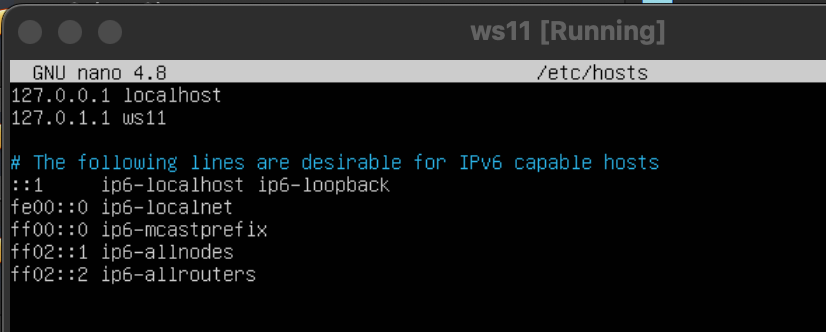

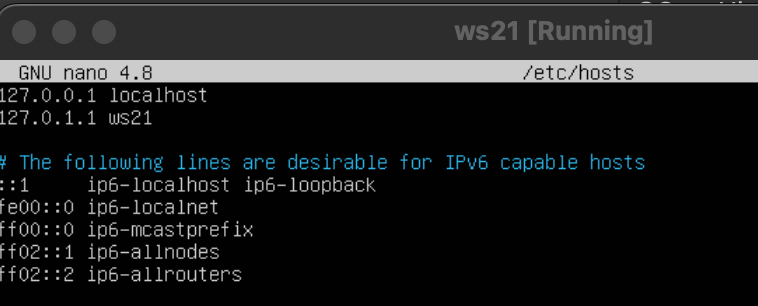

* ``sudo reboot`` на всех машинах

#### 5.1. Настройка адресов машин

* ##### Создаю нужное колличество адаптеров для всех машин по следующим критериям:

* ##### r1 

* ##### r2

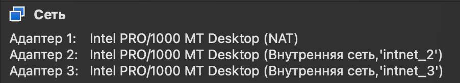

* ##### ws11

* ##### ws21

* ##### ws22

* #### Настраиваю конфигурации машин в etc/netplan/00-installer-config.yaml согласно сети на рисунке (в задании).

* ##### r1 

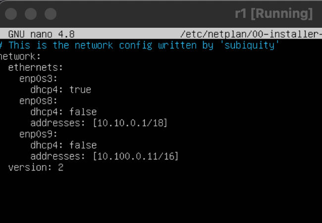

* ##### r2

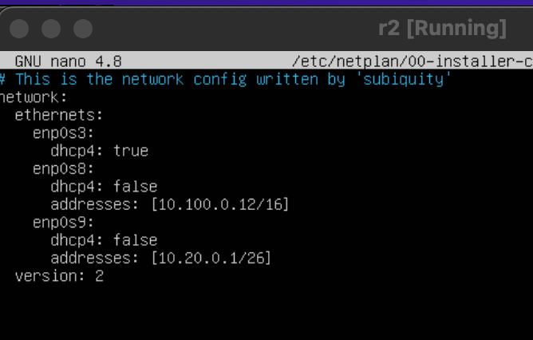

* ##### ws11

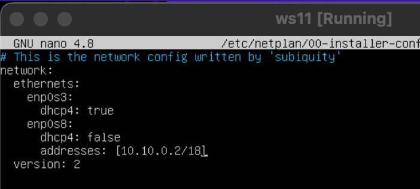

* ##### ws21

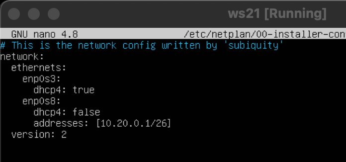

> далее исправила 

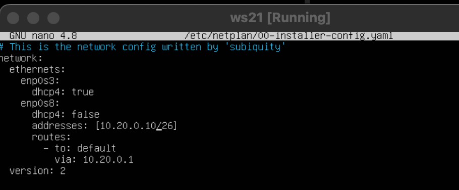

* ##### ws22

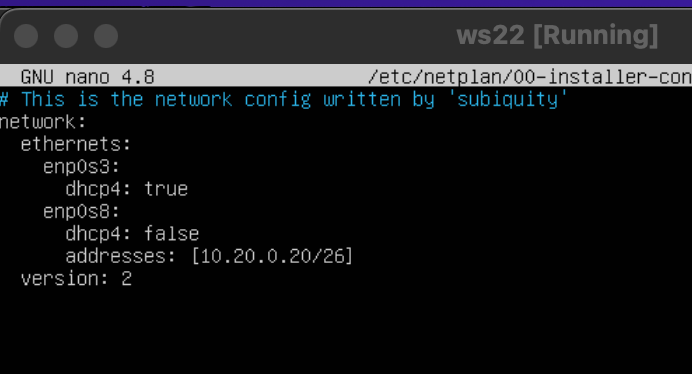

* #### Перезапускаю сервис сети.

* Ввожу команду  ``sudo netplan apply`` на всех машинах 

* #### Проверяю все машины командой  ``ip -4 a``

* ##### r1 

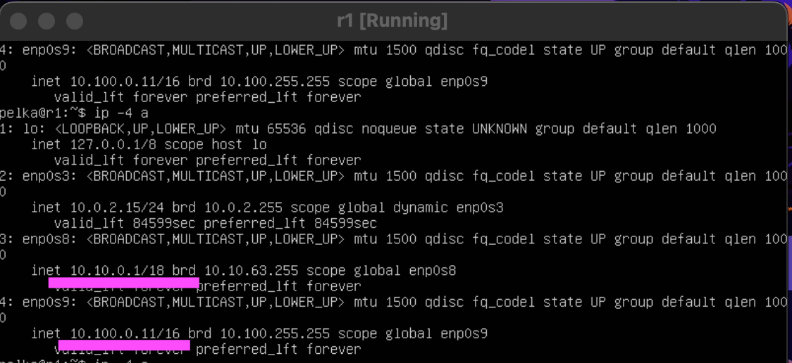

* ##### r2

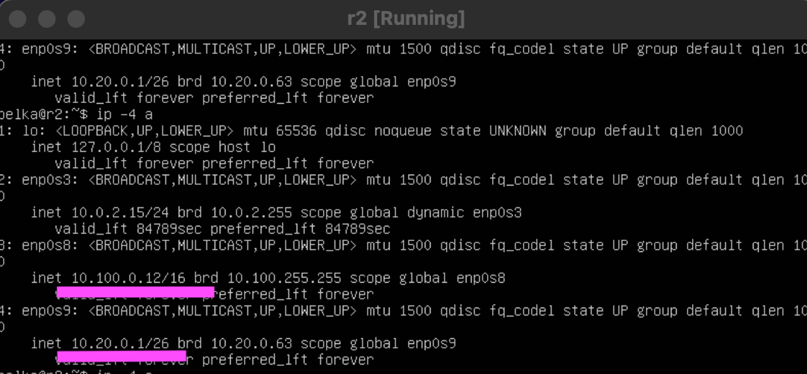

* ##### ws11

* ##### ws21

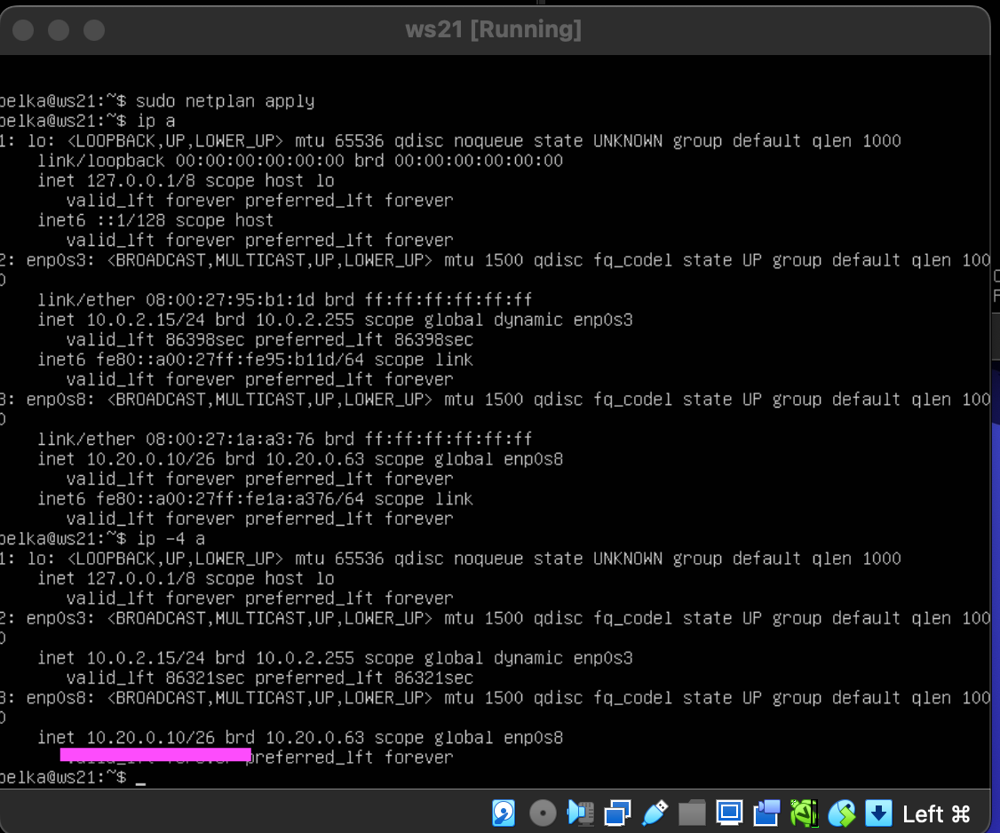

* ##### ws22

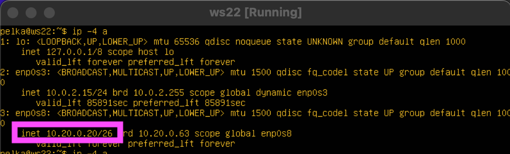

* #### Также пингую ``ws22`` с ``ws21``.

* Пингую ws22 с ws21 командой ``ping -c 5 10.20.0.20 ``

* Пингую ws21 с ws22 командой ``ping -c 5  10.20.0.10``

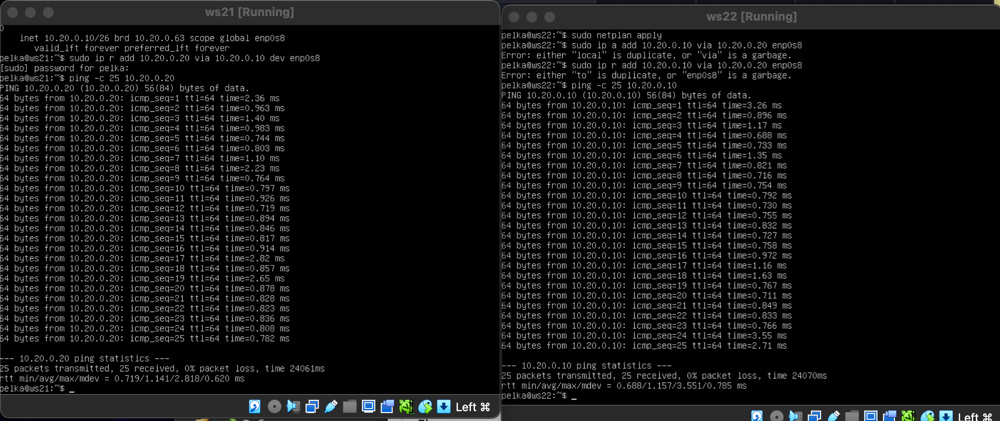

 * #### Аналогично пингую ``r1`` с ``ws11``.

* Пингую ws11 с r1 командой ``ping -c 5 10.10.0.2  ``

* Пингую r1 с ws11 командой ``ping -c 5  10.10.0.1``

 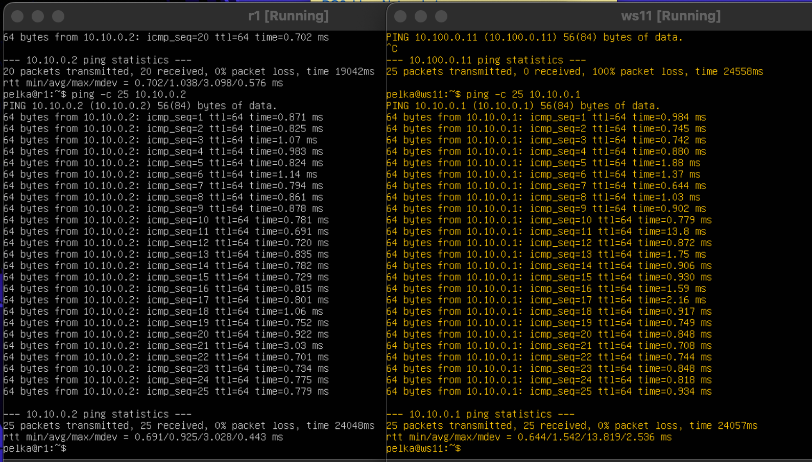

#### 5.2. Включение переадресации IP-адресов

* #### Для включения переадресации IP, выполняю команду на роутерах: 

* ``sysctl -w net.ipv4.ip_forward=1``

 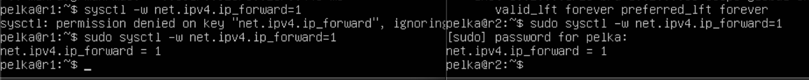

 > Но при таком подходе переадресация не будет работать после перезагрузки системы.

* #### Откываю файл sysctl.conf и добавляю в него следующую строку  ``net.ipv4.ip_forward = 1``

* Ввожу команду ``sudo nano /etc/sysctl.conf``

* Раскоменчиваю нужную строку 

 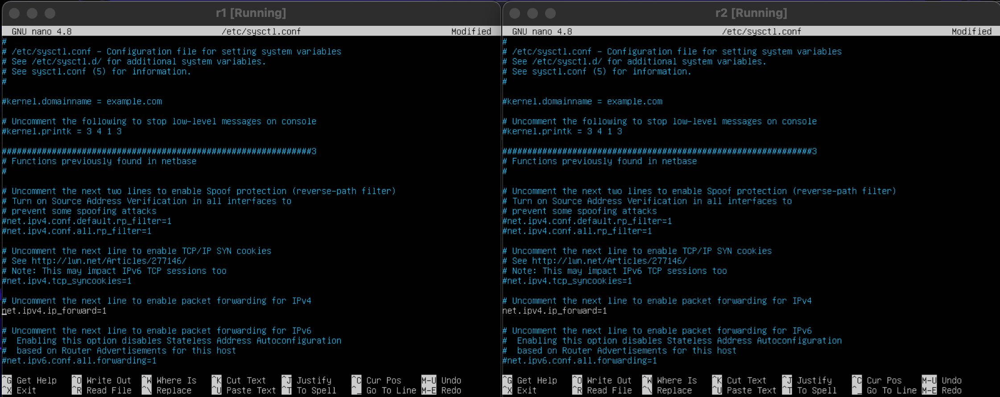

#### 5.3. Установка маршрута по-умолчанию

* #### Настраиваю маршрут по-умолчанию (шлюз) для рабочих станций. Для этого добавляю ``default`` перед IP роутера в файле конфигураций

*  Открываю netplan командой ``sudo nano /etc/netplan/00-installer-config.yaml`` на ws11, ws21, ws22 и добавляю изменения

 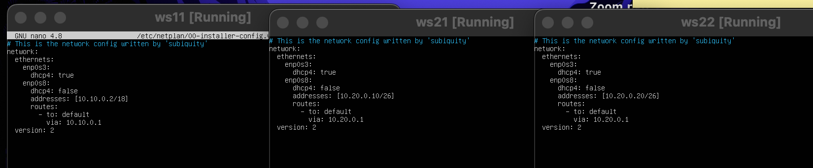

 * Ввожу команду  ``sudo netplan apply`` на всех машинах 

* #### Вызваю ``ip r`` и показываю, что добавился маршрут в таблицу маршрутизации

 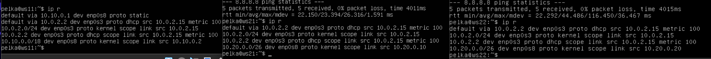

* #### Пингую с ``ws11`` роутер ``r2`` и показываю на ``r2``, что пинг доходит. 

> пинг не пройдёт, т.к. роутер "не знает" куда вернуть ответ, при этом передача пакетов с машины осуществляется. Чтобы посмотреть какие девайсы можно пропинговать ``tcpdump -D ``

* Скачиваю нужную улитилиту на r2 ``sudo apt install tcpdump``

* Далее ввожу команду: ``tcpdump -tn -i eth1`` на r2

* Ввожу команду на ws11  ``ping -c 10.100.0.12``

 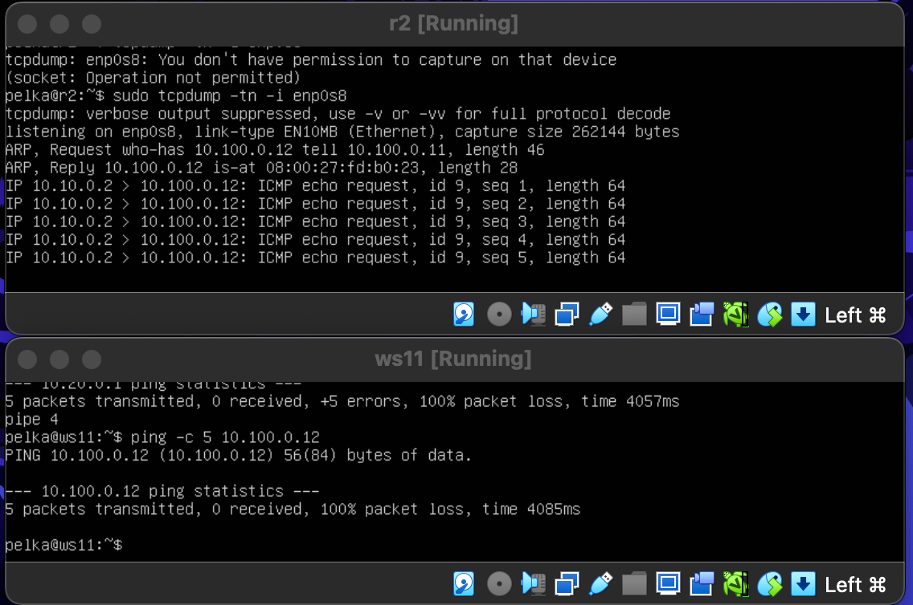

#### 5.4. Добавление статических маршрутов

* #### Добавляю в роутеры r1 и r2 статические маршруты в файле конфигураций. 

* Делаю изменения в __r1__ из шаблона и в __r2__ по аналогии

 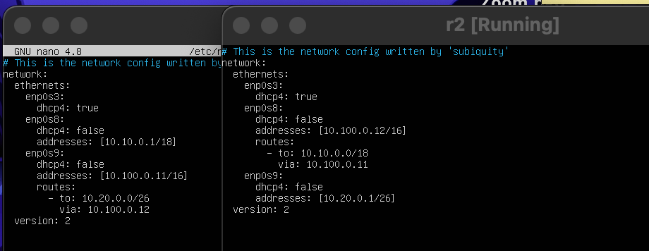

 * Выполняю команду ``netplan apply`` 

* #### Вызваю ``ip r`` и показываю таблицы с маршрутами на обоих роутерах. 

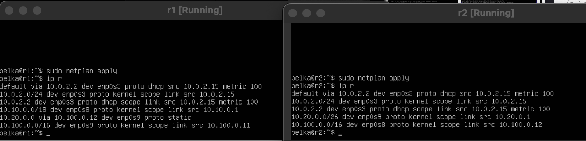

* #### Запускаю команды на ws11:

``ip r list 10.10.0.0/18``

``ip r list 0.0.0.0/0``

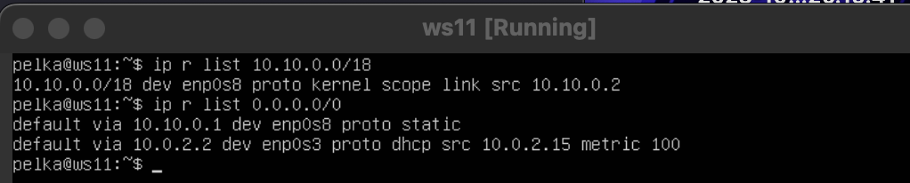 

> Для адреса 10.10.0.0/18 был выбран маршрут, отличный от 0.0.0.0/0 (он попадает под маршрут по-умолчанию), т.к. машина ws11 соединена с сетью 10.10.0.0/18 по своему IP-адресу 10.10.0.2, для других адресов используется маршрут по умолчанию, который указан в файле 10.10.0.1.

#### 5.5. Построение списка маршрутизаторов

* #### Запускаю на r1 команду дампа:

* ``tcpdump -tnv -i enp0s8``

> __-n__ - не конвертировать адреса в имена;
__-t__ - не выводить время при выводе каждой строкчи дампа;
__-v__ - при синтаксическом анализе и выводить более подробную информацию. Например, печатаются время создания, общая длина и параметры IP-пакета. Также включает дополнительные проверки целостности пакетов, такие как проверка контрольной суммы заголовка IP и ICMP.

* #### При помощи утилиты ``traceroute`` строю список маршрутизаторов на пути от ws11 до ws21

* Устанавливаю ультилиту на машину командой ``sudo apt install traceroute``

* Запускаю команду ``traceroute 10.20.0.10``

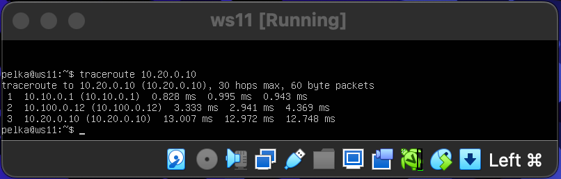 

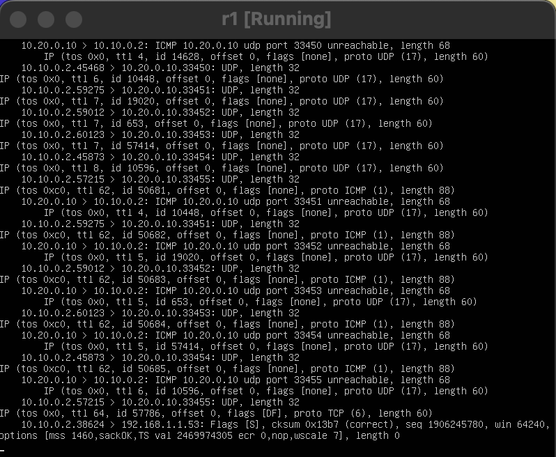 

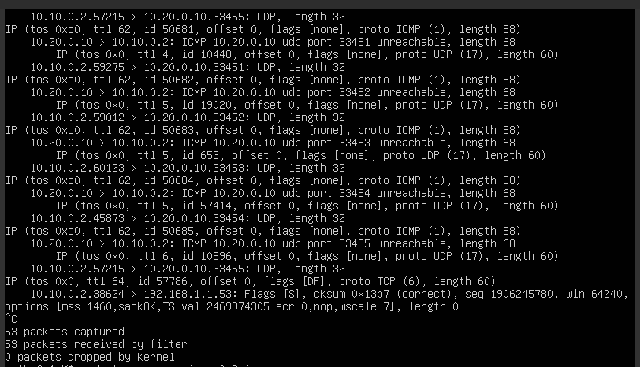 

> Каждый пакет проходит на своем пути определенное количество узлов, пока достигнет своей цели. Причем, каждый пакет имеет свое время жизни. Это количество узлов, которые может пройти пакет перед тем, как он будет уничтожен. Этот параметр записывается в заголовке TTL, каждый маршрутизатор, через который будет проходить пакет уменьшает его на единицу. При TTL=0 пакет уничтожается, а отправителю отсылается сообщение Time Exceeded.
Команда traceroute linux использует UDP пакеты. Она отправляет пакет с TTL=1 и смотрит адрес ответившего узла, дальше TTL=2, TTL=3 и так пока не достигнет цели. Каждый раз отправляется по три пакета и для каждого из них измеряется время прохождения. Пакет отправляется на случайный порт, который, скорее всего, не занят. Когда утилита traceroute получает сообщение от целевого узла о том, что порт недоступен трассировка считается завершенной.

#### 5.6. Использование протокола ICMP при маршрутизации

* #### Запускаю на r1 перехват сетевого трафика, проходящего через eth0 с помощью команды ``tcpdump -n -i eth0 icmp``

* #### Пингую с ws11 несуществующий IP (например, 10.30.0.111) с помощью команды ``ping -c 1 10.30.0.111``

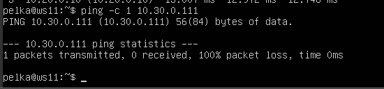 

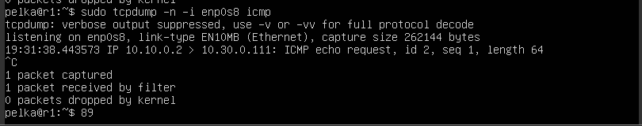 

* #### Сохраняю дампы образов виртуальных машин

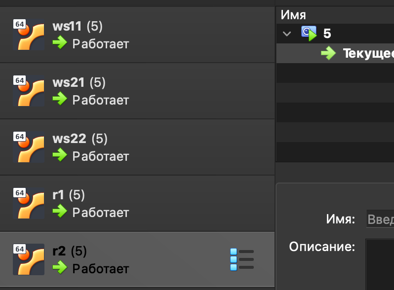 

***

## Part 6. Динамическая настройка IP с помощью DHCP

 * #### Для r2 настроить в файле /etc/dhcp/dhcpd.conf конфигурацию службы DHCP:

 * Скачиваем ультилиту ``sudo apt install isc-dhcp-server`` 

* Заходим в фаил ``sudo nano /etc/dhcp/dhcpd.conf``

> до 

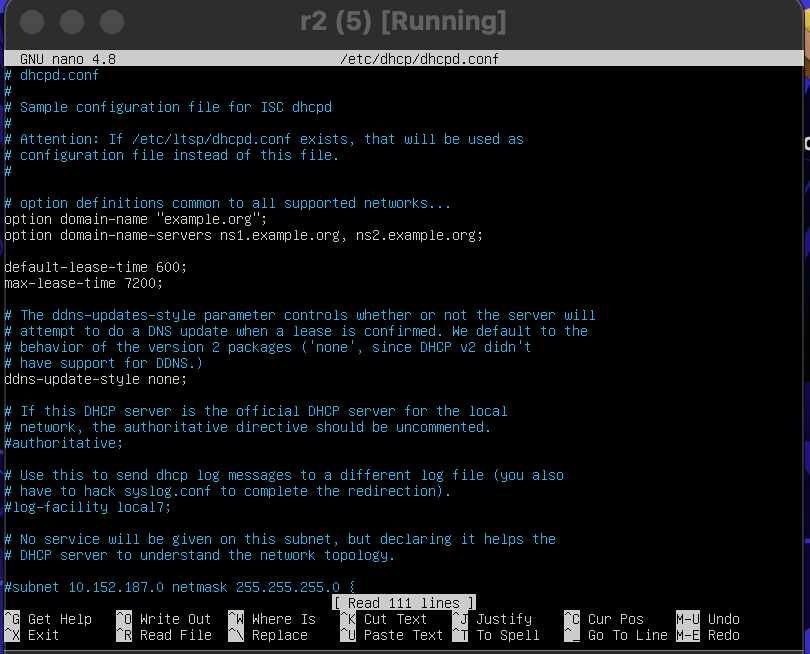

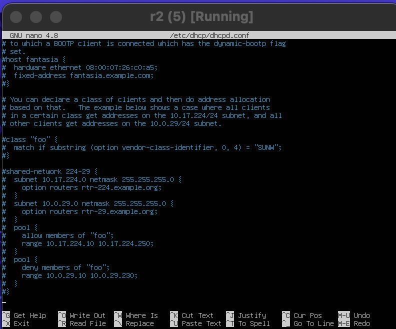

 * #####  Указываю адрес маршрутизатора по-умолчанию, DNS-сервер и адрес внутренней сети. 

> После 

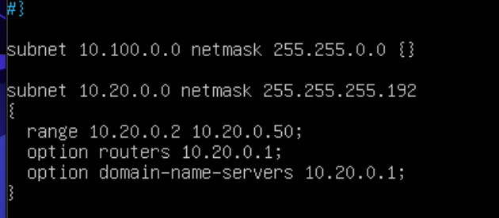

* ##### В файле resolv.conf прописываю nameserver 8.8.8.8.

* Заходим в фаил ``sudo nano /etc/resolv.conf``

> до 

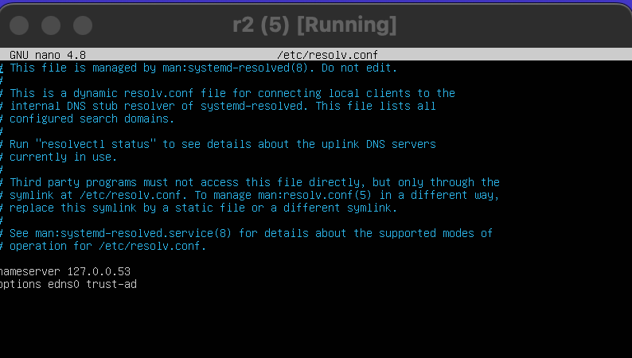 

> После 

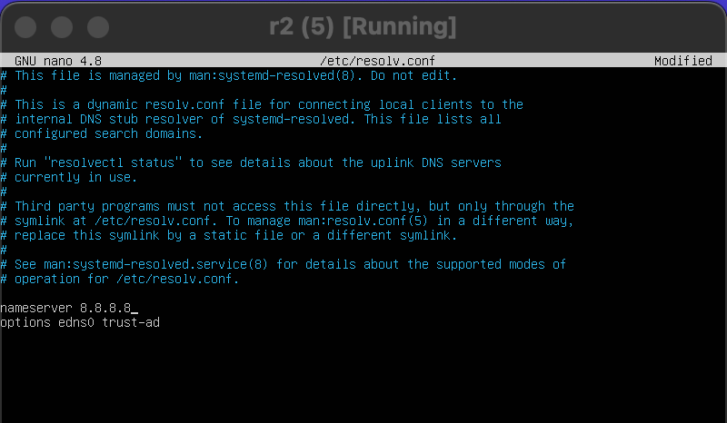 

* #### Перезагружаю службу DHCP командой ``systemctl restart isc-dhcp-server``

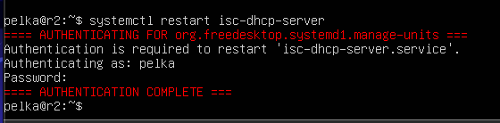 

* #### Проверяю работу службы DHCP командой ``systemctl status isc-dhcp-server``

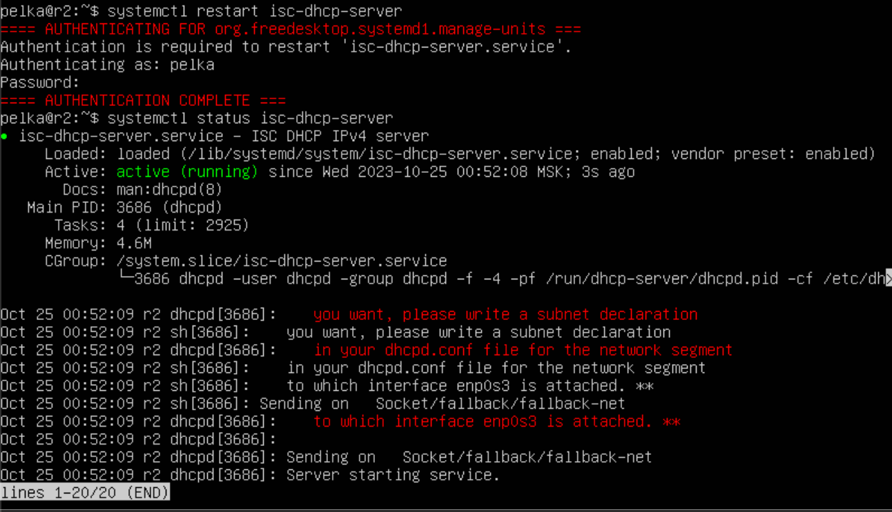 

* Для работы пришлось немного поменять ``netplan`` у ws21 и ws22

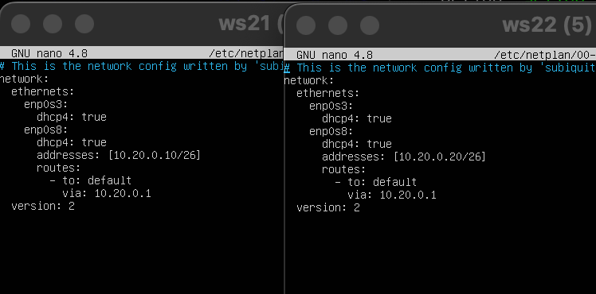 

* ##### Машину ws21 перезагружаю при помощи ``reboot`` и через ``ip a`` показываю, что она получила адрес. 

 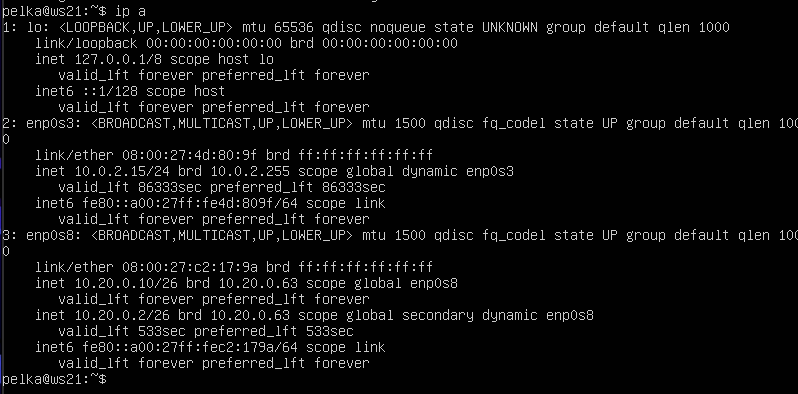 

  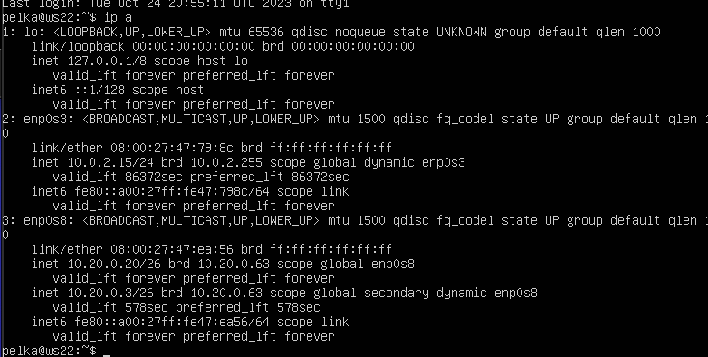 

* ##### Также пингую ws22 с ws21

 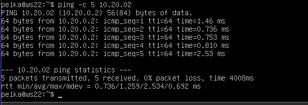

* ### Указываю MAC адрес у ws11

* #### Для r1 настраиваю аналогично r2, но делаю выдачу адресов с жесткой привязкой к MAC-адресу (ws11). Провожу аналогичные тесты

> Для этого в ``etc/netplan/00-installer-config.yaml`` надо добавить строки: ``macaddress: 10:10:10:10:10:BA, dhcp4: true``

* Выключаю виртуальную машину __ws11__

* В __VirtualBox__ добавляю __macaddress__

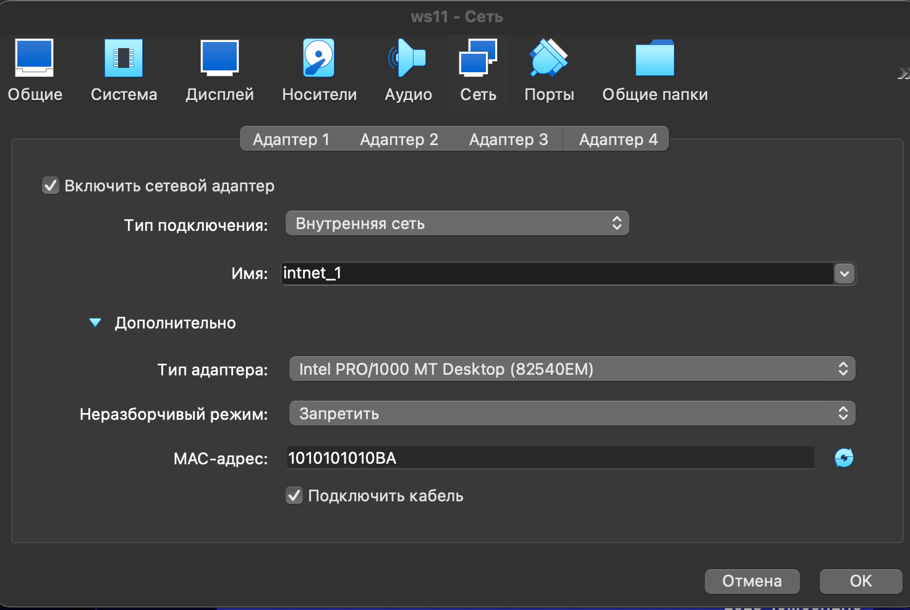

*  Указываю адрес маршрутизатора по-умолчанию, DNS-сервер и адрес внутренней сети. 

* #### Для r1 настроим аналогично r2, но выдачу адресов сделаем с жесткой привязкой к MAC-адресу (ws11).

* ``sudo apt-get install isc-dhcp-server``

* ``sudo nano /etc/dhcp/dhcpd.conf``

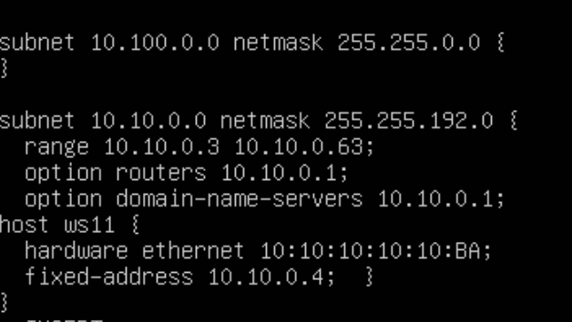

* В файле ``resolv.conf`` прописываю nameserver 8.8.8.8.

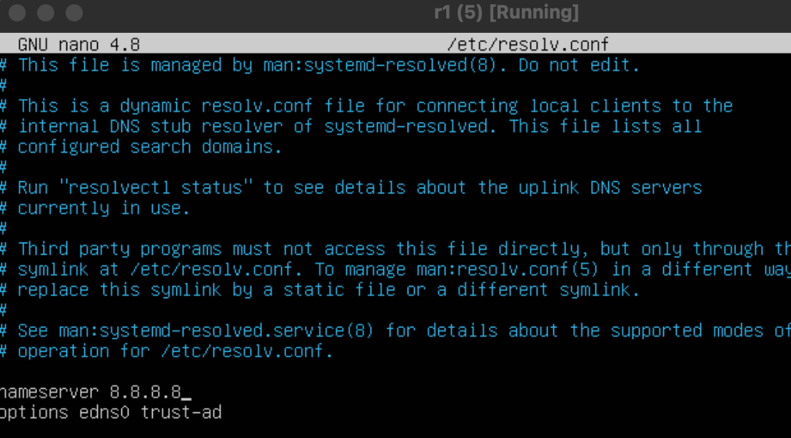

* Меняю нетплан на ws11 

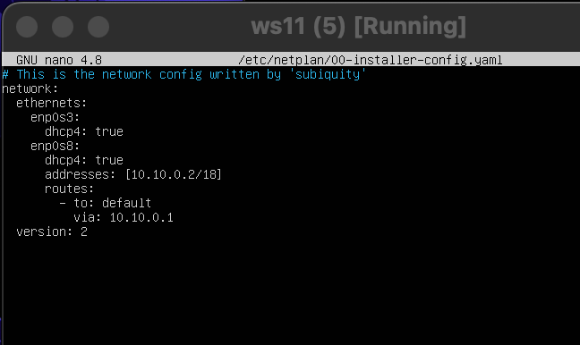

* Перезагружаю службу DHCP командой ``systemctl restart isc-dhcp-server``.

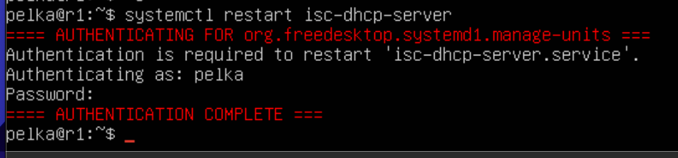

*  Проверяю работу службы __DHCP__ командой ``systemctl status isc-dhcp-server``

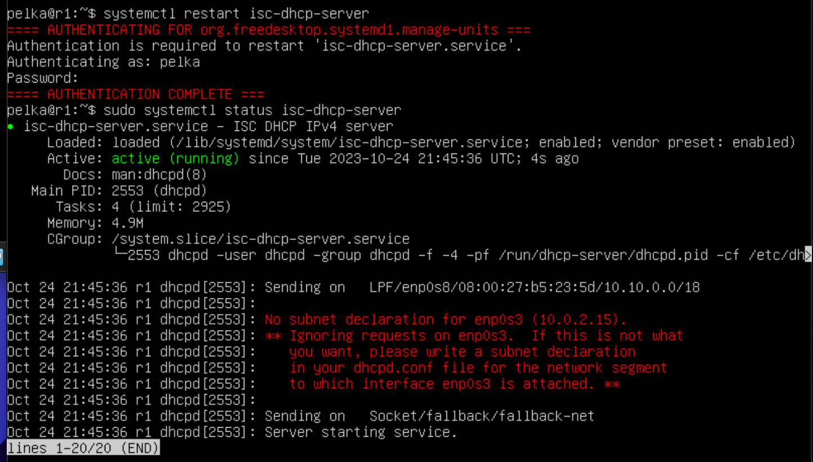

* ##### Машину ws11 перезагружаю при помощи ``reboot`` и через ``ip a`` показываю, что она получила адрес. 

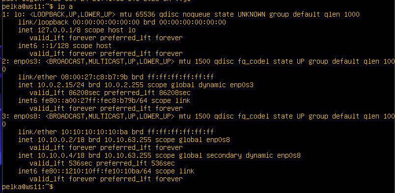

* ##### Также пингую ws22 с ws11

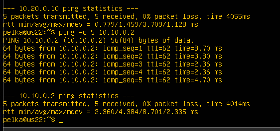

* #### Запрашиваю с ws21 обновление ip адреса

* Проверяю __ip__ до обнавления 

* ip a

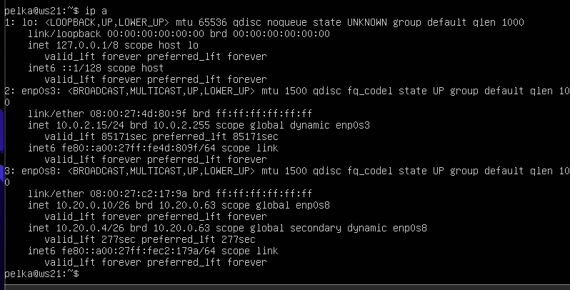

* Запросим обновление ip командой ``sudo dhclient -v``

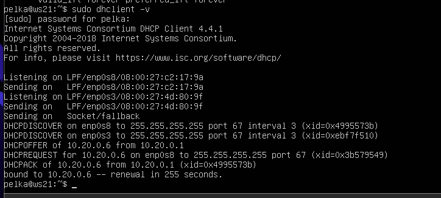

* Проверяем 

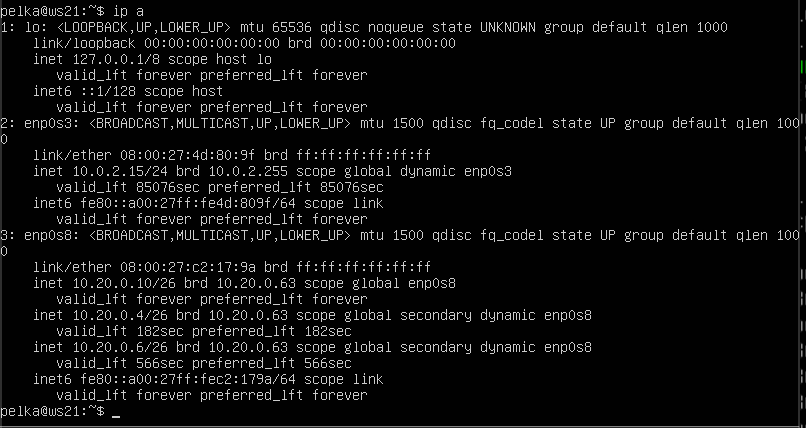

* Выполняем команду для удаления старого адресса ``sudo dhclient -r``

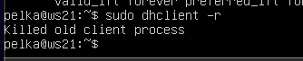

* Проверяем 

* ``ip a``

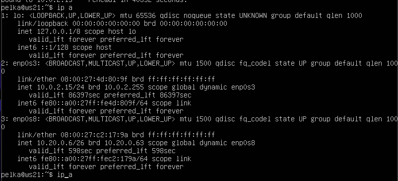

* Чтобы освободить или обновить конкретный адресс используем следующие команды: 

``sudo dhclient -r eth0``

``sudo dhclient eth0``

> В части 6 были использованы следующие опции DHCP протокола:
option routers ip-address [, ip-address...]; - адреса шлюзов для клиентской сети. Маршрутизаторы должны быть перечислены в порядке предпочтительности.
option domain-name-servers ip-address [, ip-address...]; - Список DNS серверов доступных клиенту. Сервера должны быть перечислены в порядке предпочтительности.

* #### Сохраняю дампы образов виртуальных машин

***

## Part 7. NAT 

###### В данном задании используются виртуальные машины из Части 5

* Скачиваем ``sudo apt install apache2`` на __r1__ и __ws22__ 

* #### В файле /etc/apache2/ports.conf на ws22 и r1 меняю строку ``Listen 80`` на ``Listen 0.0.0.0:80``, то есть делаю сервер ``Apache2`` общедоступным

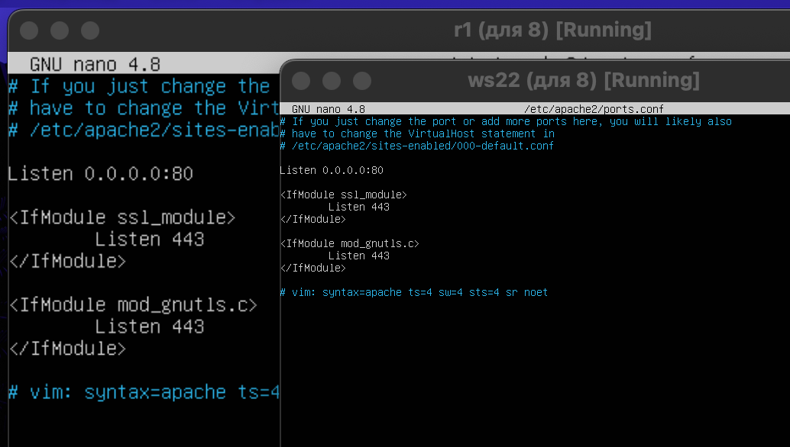

* #### Запускаю веб-сервер ``Apache`` командой ``service apache2 start`` на ws22 и r1

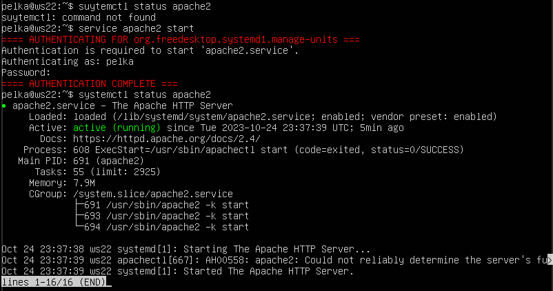

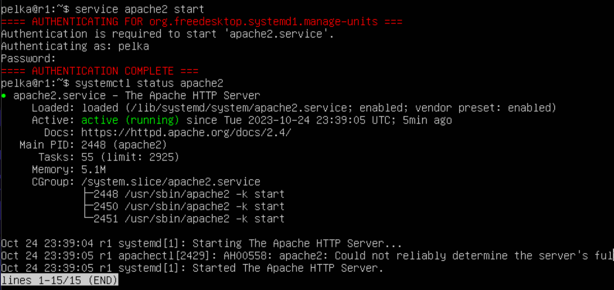

> Проверила командой ``systemctl status apache2``

* #### Добавляю в фаервол, созданный по аналогии с фаерволом из Части 4, на r2 следующие правила:

* #####  удаление правил в таблице ``filter - iptables -F``
 * ##### удаление правил в таблице "NAT"  ``iptables -F -t nat``
* ##### отбрасывать все маршрутизируемые пакеты ``iptables --policy FORWARD DROP``

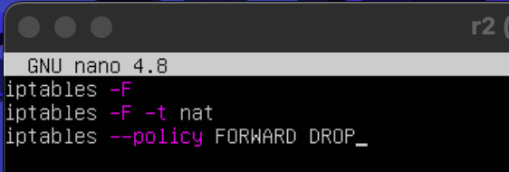

* #### Запускаю файл также, как в Части 4

* #### Проверяю соединение между ws22 и r1 командой ``ping``

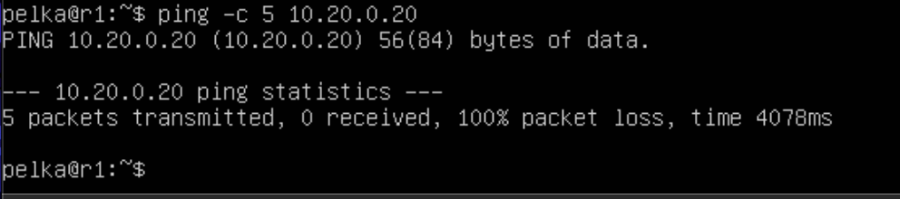

* #### Добавляю в файл ещё одно правило:

 * ##### разрешить маршрутизацию всех пакетов протокола ICMP

 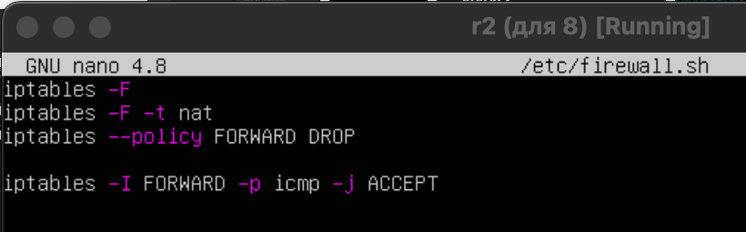

* ##### Запускаю файл также, как в Части 4

* ##### Проверяю соединение между ws22 и r1 командой ``ping``

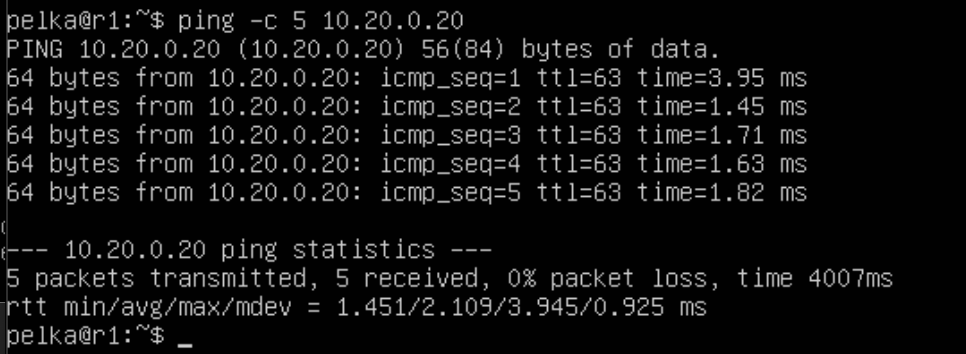

* #### Добавляю в файл ещё два правила:

 * ##### включить SNAT, а именно маскирование всех локальных ip из локальной сети, находящейся за r2 (по обозначениям из Части 5 - сеть 10.20.0.0)

 * ##### включить DNAT на 8080 порт машины r2 и добавить к веб-серверу Apache, запущенному на ws22, доступ извне сети

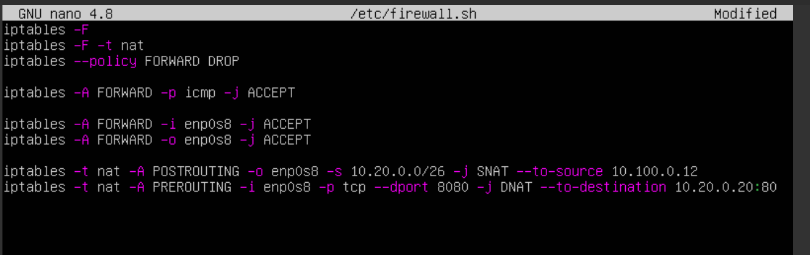

> Значения использованных опций:
__t__ - указывает на используемую таблицу;
__p__ - указывает протокол, такие как tcp, udp, udplite и другие, поддерживаемые системой, ознакомиться со списком можно в файле /etc/protocols;
__s__ - указывает адрес источника пакета, в качестве значения можно указать как один IP-адрес, так и диапазон;
__i__ - задает входящий сетевой интерфейс;
__o__ - указывает исходящий сетевой интерфейс;
__j__ — выполнение указанного действия, если правило подошло;
__--dport__ - порт получателя пакета;
__DNAT__ — подменяет адрес получателя в заголовке IP-пакета, основное применение — предоставление доступа к сервисам снаружи, находящимся внутри сети;
__SNAT__ — служит для преобразования сетевых адресов, применимо, когда за сервером находятся машины, которым необходимо предоставить доступ в Интернет, при этом от провайдера имеется статический IP-адрес.

* #### Запускаю файл также, как в Части 4

* #### Проверяю соединение по TCP для SNAT, для этого с ws22 подключаюсь к серверу Apache на r1 

* `` telnet 10.100.0.11 80 ``

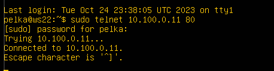

* #### Проверяю соединение по TCP для DNAT, для этого с r1 подключиться к серверу Apache на ws22 командой ``telnet`` (обращаться по адресу r2 и порту 8080)

* `` telnet 10.100.0.12 8080 ``

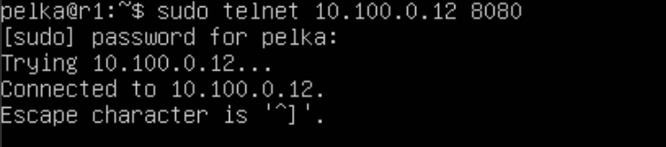

* #### Сохраняю дампы образов виртуальных машин

***

## Part 8. Дополнительно. Знакомство с SSH Tunnels

* #### Запускаю на r2 фаервол с правилами из Части 7

* #### Запускаю веб-сервер Apache на ws22 только на localhost (то есть в файле ``/etc/apache2/ports.conf`` меняю строку ``Listen 80`` на ``Listen localhost:80``)

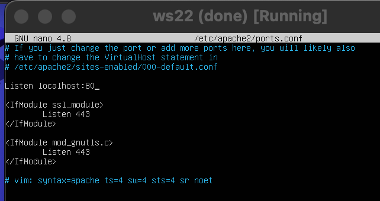

* ``service apache2 start``

* Провряю командой * ``systemctl status apache2``

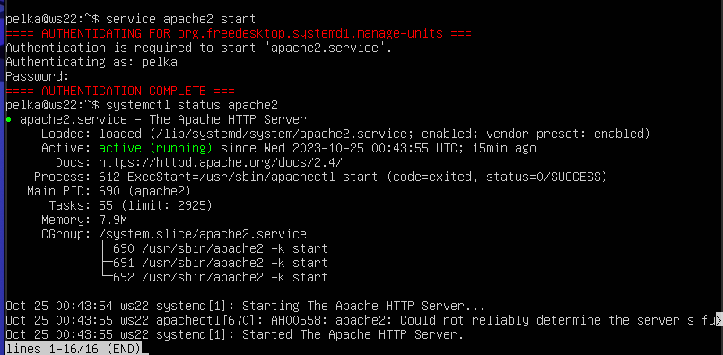

* #### Пользуюсь Local TCP forwarding с ws21 до ws22, чтобы получить доступ к веб-серверу на ws22 с ws21

> Переадресация локального порта позволяет перенаправить порт на локальном компьютере (клиент ssh) на порт на удаленном компьютере (сервер ssh), который затем перенаправляется на порт на компьютере назначения. В этом типе переадресации клиент SSH прослушивает заданный порт и туннелирует любое подключение к этому порту к указанному порту на удаленном сервере SSH, который затем подключается к порту на целевом компьютере. Конечным компьютером может быть удаленный SSH-сервер или любой другой компьютер.

 * Cоздадим соединение с машины ws22, на которой установлен сервер ssh, с машиной ws 21 командой
``ssh -L 8080:127.0.0.1:80 10.20.0.20``

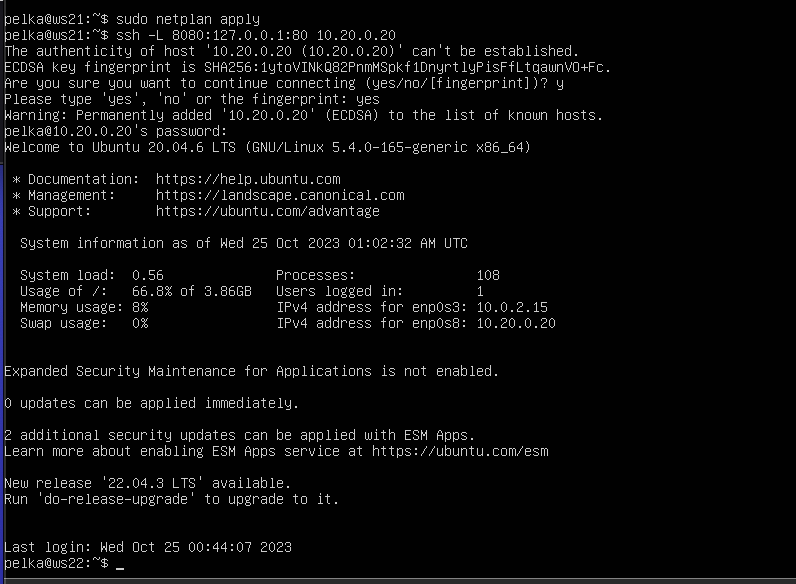

* Проверяем с помощью команды ``telnet 127.0.0.1 8080``

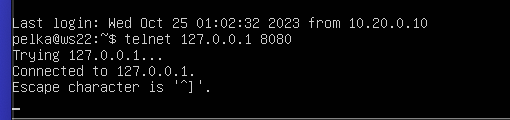

***
 :wave:
